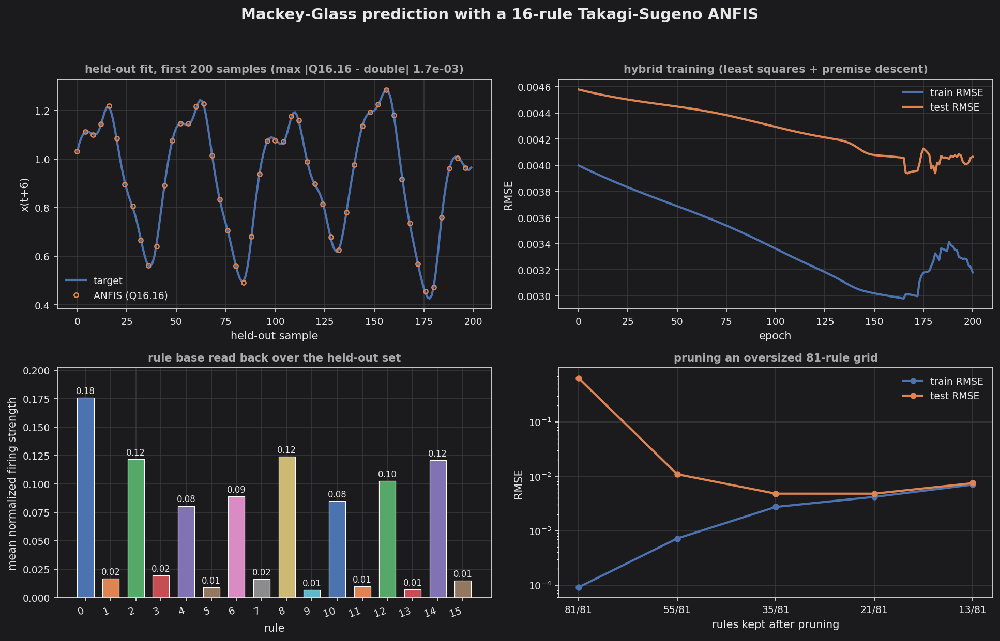

# Mackey-Glass ANFIS

Jang's original 1993 benchmark for ANFIS: predict `x(t+6)` of the
Mackey-Glass chaotic time series from four delayed samples — `x(t-18)`,
`x(t-12)`, `x(t-6)`, `x(t)`.

Two generalized-bell membership functions per input over the full grid is
`2^4 = 16` rules with first-order consequents. **448 bytes** of model in
Q16.16 (16 premise + 80 consequent parameters, plus a 64-byte rule table).

## Results

| | value |
|---|---|
| rules | 16 |
| premise / consequent parameters | 16 / 80 |
| Q16.16 model size | 448 bytes |
| held-out samples | 500 |
| test RMSE (double) | 0.004066 |
| test RMSE (Q16.16) | 0.004081 |
| max abs Q16.16 vs double | 0.001677 |

Test RMSE is 0.43% of the target range. The fixed-point path costs 0.4%
more error than the double reference — measured, not assumed, which is why
the example runs the same frozen model twice.

The C++ double result reproduces the Python trainer's number exactly
(0.004066), so the two implementations of the forward pass agree.



## Build

```bash
make            # debug
make release    # -O3
make run        # writes the CSVs into output/
make plot       # renders output/anfis_prediction_behavior.png
```

The model is committed as `anfis_model.hpp`, so the build needs no Python.
To refit:

```bash
make regenerate-model    # runs train.py, rewrites anfis_model.hpp + anfis_data.hpp
```

`train.py` needs numpy. Use an isolated environment — never system Python.

## Golden regression

`make golden` emits a deterministic byte stream that `unit_test/integration`
locks byte-for-byte, the same gate the int8 exemplars carry.

The stream contains only **raw Q16.16 integers** and rule indices — never
formatted doubles. The fixed-point path is pure integer arithmetic, so its bit
patterns are reproducible across compilers and optimization levels, while
printed floating point is not; a golden that drifts with the platform is worse
than no golden. Verified identical under `-O0`, `-g`, `-O3`, and
`-O2 -ffast-math`.

The rule indices are in the stream alongside the outputs because the
defuzzified value alone could mask a regression in the premise or product
t-norm stages — two different rule sets can average to a similar number.

Perturbing a single consequent parameter by ~0.003% shifts four of the eight
probe values, so the gate is sensitive to real drift rather than decorative.

## What the four panels show

**Held-out fit.** The prediction sits on the target through every swing of
the chaotic series. The Q16.16 output is drawn as sparse markers because a
third line would simply hide under the other two.

**Hybrid training.** Epoch 0 is the least-squares-only baseline (test RMSE
0.004579); tuning the premises alongside it reaches 0.004066. The late
wobble is the fixed-size normalized step bouncing once it is near the
optimum.

**Rule base read back.** Per-rule mean normalized firing strength over the
held-out set — what fraction of the output each rule owned. Rule 0 carries
18%, and the eight odd-numbered rules together carry under 10%. Odd rule
index means "the second membership function of `x(t)`", so the model barely
uses the upper half of its most recent input. That is the kind of statement
a dense net of the same size cannot make about itself, and it is the reason
to reach for ANFIS here.

**Pruning an oversized grid.** Three membership functions per input is 81
rules and 405 consequent parameters against 500 training samples, and it
overfits catastrophically — train RMSE 0.000091, test RMSE **0.636**. Pruning
by mean firing strength recovers it: 21 of 81 rules gives test RMSE 0.004793,
a ~130x improvement while shipping 26% of the rule base. This is why
`cpp/anfis.hpp` carries an explicit rule table rather than an implicit
`M^N` grid.

Read those figures qualitatively. The unpruned 81-rule design matrix is rank
deficient — rank 402 of 405, condition number 9.0e12 — so which least-squares
solution the 200-epoch premise trajectory lands on shifts with floating-point
summation order; the unpruned test RMSE has been observed anywhere from 0.64
to 1.77 across equivalent code paths. The shape of the result is robust, the
digit is not. The shipped 16-rule model is a different regime: rank 80 of 80,
condition number 1.9e5, and reproducible exactly.

## Deployment note

The shipped model uses generalized-bell membership functions with the
exponent pinned at 1, so inference is compare/add/multiply/divide only — no
transcendental function and no lookup table. The model would deploy
unchanged at `TINYMIND_ENABLE_FLOAT=0` / `TINYMIND_ENABLE_STD=0`. The
example itself enables `FLOAT` and `STD` only because it runs a double
reference alongside the Q16.16 path and uses `<cmath>` for its error
metrics.
