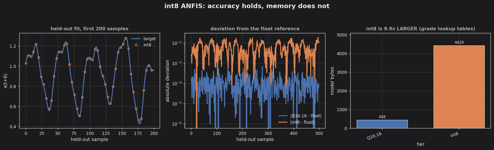

# int8 Mackey-Glass ANFIS

The same model as [`anfis_mackey_glass`](../anfis_mackey_glass/), run through
`cpp/qanfis.hpp` — and a deliberate negative result.

**int8 is 9.9x LARGER than Q16.16 for this model.** That is the point of the
exemplar. Everywhere else in TinyMind moving to int8 shrinks a model; here it
does not, and it is better to measure that than to let the assumption ride.



## Results

| tier | test RMSE | model bytes |
|---|---|---|
| float reference | 0.003997 | — |
| Q16.16 | 0.003994 | **448** |
| int8 | 0.008584 | **4428 (9.9x)** |
| int8, no ridge | 0.025452 | — |

Accuracy holds: int8 costs about 2.1x the float reference's error, on a target
spanning 0.94.

## Why int8 is bigger

An int8 layer's parameters are usually its weights, and halving their width
halves the model. ANFIS spends most of its parameters on membership functions
instead, and `cpp/qanfis.hpp` evaluates those through a **256-entry lookup
table per (input, membership function) pair** — that is what makes the
membership shape irrelevant at runtime.

Those tables cost 512 bytes each no matter how few parameters the shape they
replaced had. A Q16.16 generalized bell is two numbers, eight bytes. Its int8
lookup table is 512.

```
grade lookup tables   4096 bytes   92.5% of the int8 model
everything else        332 bytes
```

Per *rule*, int8 is genuinely cheaper — 20 bytes against Q16.16's 24. The
lookup tables are a fixed cost, so the crossover is that fixed cost divided by
the per-rule saving:

**int8 overtakes Q16.16 at about 1024 rules.**

This model has 16. A rule base three orders of magnitude larger would flip the
result, but published fuzzy hardware overwhelmingly ships under 25 rules, so in
practice the Q-format tier is the smaller one.

## So when is the int8 tier worth it?

Not for footprint. For **pipeline consistency**: an int8 frontend — a
quantized conv stack, an int8 feature extractor — can feed ANFIS directly, with
no `qbridge` conversion and no float anywhere on the hot path. If the rest of
the model is already int8, paying 4 KB to keep the whole graph integer may be
the right call. If ANFIS is the whole model, use Q16.16.

## The ridge lesson, measured

The example also runs the pipeline over an unregularized fit of the same
architecture:

| consequent solve | largest coefficient | int8 test RMSE |
|---|---|---|
| ridge = 1e-6 | 9.58 | 0.008584 |
| ordinary least squares | 168.98 | 0.025452 |

Unregularized least squares produces large coefficients that nearly cancel. In
float that is harmless — both fits score about 0.004. In int8 it is not: the
input carries half a quantization step of error, and a coefficient of 169
amplifies it past the output quantum, breaking the cancellation the fit depends
on. This is why `apps/anfis_train` has a `ridge` parameter, and why a model
bound for `qanfis.hpp` should use it.

## Build and run

```bash
cd examples/anfis_mackey_glass_int8
make release
make run                 # writes output/*.csv
make golden              # deterministic byte stream for the integration gate
make plot                # needs matplotlib
make regenerate-model    # optional: refit with train.py (needs numpy)
```

Built with `TINYMIND_ENABLE_QUANTIZATION=1` plus `FLOAT=1 STD=1`, because the
example calibrates on the host and runs a double reference. The deployable int8
forward path needs neither.

`make run` fails the build if int8 error exceeds 4x the float reference, so the
comparison is a gate rather than a printout.

## Golden regression

The stream carries the **footprint numbers alongside the outputs**, since the
headline result here is the memory comparison — a silent change in lookup-table
sizing would otherwise slip past. Verified identical under `-O0`, `-g`, and
`-O3`.
