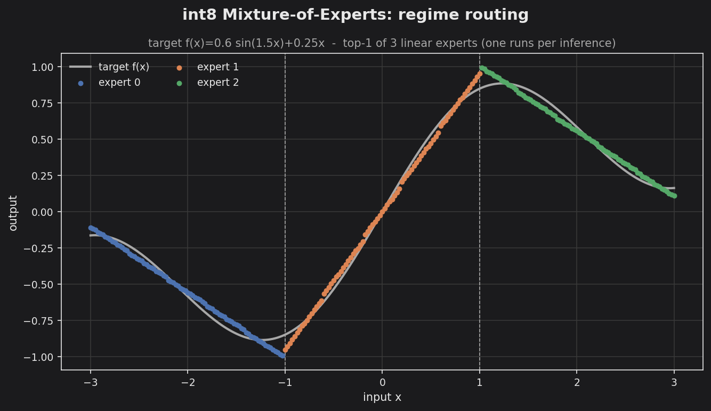

# moe_regimes_int8 — Mixture-of-Experts regime routing (int8)

A heterogeneous 1D regression that shows what a top-1 Mixture-of-Experts buys
on an embedded target. The nonlinear target `f(x) = 0.6·sin(1.5x) + 0.25x` is
approximated by **three linear experts**; a tiny linear router partitions the
input domain into three regimes and picks one expert per input.



Each color block is the output of a single expert, so the colors *are* the
routing map: the router's argmax over three lines is the upper envelope of
those lines, which falls out as three contiguous x-intervals (boundaries at
x = ±1, dashed). Inside each regime its expert is the least-squares line fit to
the curve — the classic "mixture of linear experts approximates a nonlinear
function" picture.

The whole thing is deployed int8 through `cpp/qmoe.hpp::QMixtureOfExperts`:
the router argmaxes over **raw int32 logits** (no requant — argmax is invariant
to a shared positive scale), each expert carries its **own** per-expert weight
scale, and all experts requantize into one **shared** output scale.

## The embedded headline: compute ≠ memory

Of the three resident experts, exactly **one** runs per inference. `make bench`:

```
MoE compute/memory accounting (top-1 routing)
  experts resident         : 3
  experts run per inference : 1
  resident params (bytes)   : 12  (router + all experts, all must be in flash)
  active params per call    : 8  (router + selected expert)
  MACs per inference        : 4  (router 3 + 1 expert 1)
  MACs if all experts ran   : 6  (dense-MoE upper bound)
  routing over domain       : e0=80 e1=81 e2=80
```

Active compute scales with `k` (here k=1 expert + router); resident memory
scales with the expert count `N`. MoE trades flash — cheap and abundant — for
flat per-inference compute and the modeled capacity of `N` experts. The visible
gap between prediction and target is the **3-line approximation**, not int8
loss: one output LSB is ~0.008, while the kinks near the regime boundaries are
where a piecewise-linear fit of a curving function naturally falls short.

## Build & run

```bash
make            # build (debug)
make run        # write output/moe_regimes_int8.csv (x, target, prediction, expert)
make bench      # print the compute/memory accounting
make golden     # print golden int8 bytes for a fixed probe set
make plot       # render output/moe_regimes_int8.png (set TINYMIND_PLOT_THEME=dark for the docs theme)
```

The float router + expert lines are fit inside the binary, so `make check`
runs this without numpy. In a real workflow the same router + per-expert
weights would be trained offline and loaded from a `tinymind_import`-emitted
`weights.hpp` — see `examples/import_moe_demo` for that round-trip.
